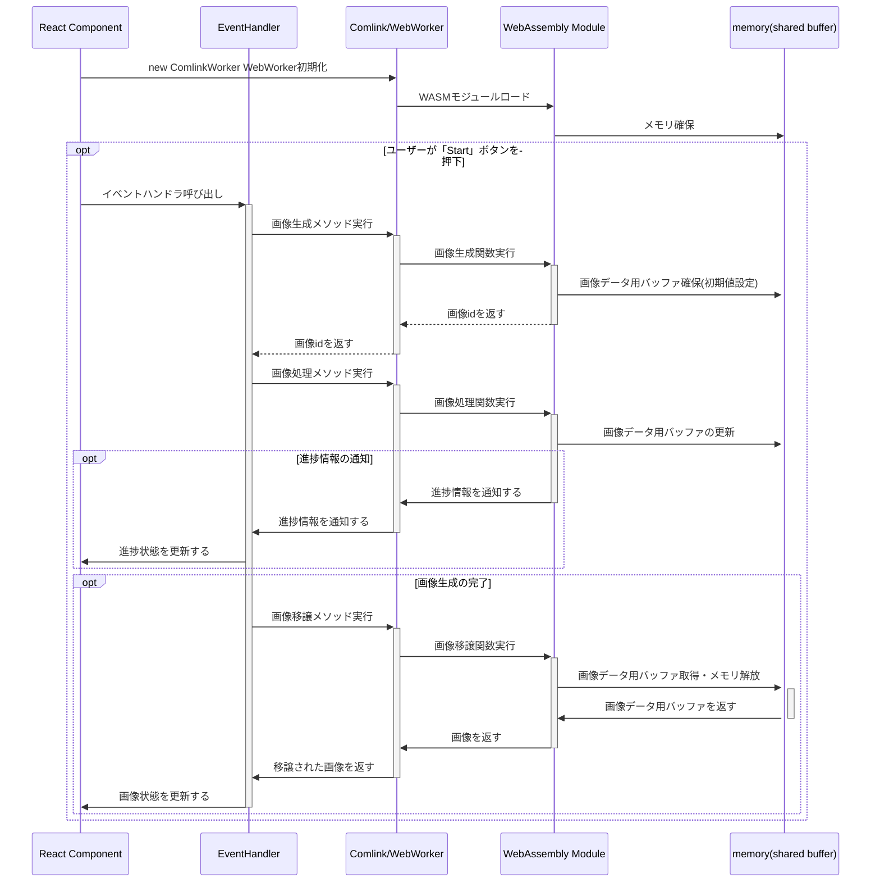

# これは何？

https://x.com/kubohiroya/status/1868272358794150117

その名の通り、Vite+React+Comlink/WebWorker+AssemblyScript+WebGPUを組み合わせたものを開発する際のボイラープレートとなるような、設定ファイルおよびサンプルコード一式を開発するものです。

このプロジェクトをビルドすると、Reactアプリとして作られたサンプルコードを動作させることができます。これは、

1. JavaScript
2. JavaScript + WebWorker
3. AssemblyScript
4. AssemblyScript + WebWorker
5. WebGPU Compute Shader

という[5つの方式を比較しながら動かすことがでるベンチマークアプリ](https://kubohiroya.github.io/vite-react-comlink-worker-assemblyscript-webgpu-boilerplate/)になっています。

* それぞれの実装は、3x3の平均化の画像処理を行うものになっています（要するに、画像に「ぼかし」処理の一種を施すという内容です）。
* この画像処理を、ユーザの指定により、0回から〜500回までの任意の回数で、繰り返し適用できるようにしています。
* 繰り返し画像処理の進捗状況として、現在処理をしている回および処理の経過時間を、コンポーネント上で表示するようにしています。
* UIスレッドがブロックされてしまう状況を確認するために、画面上部にデジタル時計を常時表示しています。

次の表は、このサンプルコードを MacBook Pro 16インチ 2021(Apple M1 Max 64GB)で動作させた結果を示したものです。「[富嶽三十六景 神奈川沖浪裏](https://ja.wikipedia.org/wiki/%E7%A5%9E%E5%A5%88%E5%B7%9D%E6%B2%96%E6%B5%AA%E8%A3%8F)」の1024x706ピクセル(24ビット色)の画像に、3x3平均化フィルタ処理を200回繰り返し行っています。

実際に動作している様子の動画を、[Xのほうにポストした](https://x.com/kubohiroya/status/1868272358794150117)ので、ご覧ください。

| 動画内の該当部分| 実装                     | 実行時間  | UIスレッドのブロック|
|-----------|----------------------------|----------|-----------------|
| 0:00-0:08 | JavaScript                 | 4.52秒    | される          |
| 0:09-0:15 | JavaScript + WebWorker     | 4.80秒    | されない        |
| 0:16-0:18 | AssemblyScript             | 1.84秒    | される          |
| 0:19-0:21 | AssemblyScript + WebWorker | 1.82秒    | されない        |
| 0:22-0:23 | WebGPU Compute Shader      | 0.07秒    | されない         |


* JavaScript → AssemblyScript(WebAssembly) → WebGPU Compute Shaderの順に、実行時間が短くなっています。
* WebWorkerを使うことによる処理のオーバーヘッドは、ほとんど無視できる程度です。
* WebWorkerを使わずに画像処理を実行する場合には、UIスレッドがブロックされ、UIが反応しなくなり、ボタンなどが押せなくなっていることに注意してください。このとき、画面上部に表示されている時計が止まっている・別ウィンドウで動かしている時計は動き続けている、ということも確認をしていただければと思います。
* WebWorkerを使うことで、UIスレッドのブロックを解消できる・時計が動き続け、進捗確認のためのUI(React Material UIのGaugeコンポーネント)の表示内容が更新されていることに注意してください。
* 最後に、WebGPU Compute Shaderの場合を示しています。WebGPUによる処理の速さは圧倒的です（なお、WebGPUは、そもそも非同期なAPIとして設計されていることもあり、UIスレッドのブロックが発生している様子は見られません）。

# ここがポイント

* 単純に実装をしていると、画像処理などのような重めのタスクの実行がUIスレッドをブロックしてしまい、ユーザビリティを損なうようになってしまうことがあります。こうした状況では、タスクをUIスレッドからオフロードし、WebWorker側で動作させることを検討するべきです。
    * ただし、WebWorkerを直接使うコードを書くのは煩雑なので、[Comlink](https://github.com/GoogleChromeLabs/comlink)を使うべきです。
* UIスレッドがブロックされてしまう時間を短縮するためには、JavaScript(TypeScript)でのコードを[AssemblyScript](https://www.assemblyscript.org/)でのコードに置き換え、WebAssemblyにコンパイルすることで、より効率的に動作させることができます。
    * ただし、AssemblyScriptを使うにしても、ユーザビリティ的には、UIスレッド側でなくWebWorker側で動作させるのを基本にしたほうが良さそうです。
* 現状でのベストプラクティスは、「Comlink/WebWorkerで処理をオフロード」と「TypeScriptで書かれたコードのAssemblyScriptへの移植」の組み合わせである、ということのように思われます。
    * このとき、ホスト側からWebWorker型・AssemblyScript内の関数を呼び出すだけでなく、WebWorker側・AssemblyScript内からホスト側で関数をコールバックできる機能が、使えるか・使いやすいかということについて、確認をしておくことも重要です。
* ただし、WebGPUを使ってよい状況であるならば、AssemblyScriptではなくWebGPUのCompute Shaderを使うことを検討するべきかもしれません。


# Comlink/Webworker/AssemblyScript版の動作シーケンス

最上流のReactコンポーネントから、最下流のWebAssemblyで管理されるメモリまでの、多段的なモジュール間で、どのようにメッセージがやりとりされているかをシーケンス図の形で示します。


一見すると、とても面倒くさい構成になっているのですが、実際には、ComlinkやWebAssemblyのおかげで、冗長性の少ない、直感的に理解しやすいコードでの開発ができるように感じています。

# 設定項目の抜粋

## package.jsonの設定

`package.json`に、

```JSON:package.json
  "type": "module"
```
を追加します。ES Modulesを使うための設定です。

これらの設定の詳細は、[package.json](https://github.com/kubohiroya/vite-react-comlink-worker-assemblyscript-webgpu-boilerplate/blob/main/package.json)を参照してください。


## vite.config.ts の設定

ビルド環境としては、[Vite](https://vite.dev/)を使います。
* [vite-plugin-assemblyscript-asc](https://github.com/krymel/vite-plugin-assemblyscript-asc) を使うことで、ViteからAssemblyScriptをビルドできます。
* [vite-plugin-restart](https://github.com/antfu/vite-plugin-restart) を併用し、vite-plugin-assemblyscript-ascがホットリロード機能に未対応であることを補います。
* [vite-plugin-comlink](https://github.com/mathe42/vite-plugin-comlink) を併用し、TypeScriptのコードからComlinkを使うための設定をします。
* このほか、Reactアプリの開発ならば、@vitejs/plugin-react を組み込むなどします。

これらの設定の詳細は、[vite.config.ts](https://github.com/kubohiroya/vite-react-comlink-worker-assemblyscript-webgpu-boilerplate/blob/main/vite.config.ts)を参照してください。

## tsconfig.jsonの設定

プロジェクトルートの`tsconfig.json`の`compilerOptions`に、次のものを追加します。

```JSON:tsconfig.json
  "compilerOptions":{
     :
    "target": "esnext",
    "module": "esnext",
    "lib": ["dom", "esnext", "webworker"],
    "types": ["node", "vite/client", "vite-plugin-comlink/client", "@webgpu/types"],
     :
  },
```

* `"target": "esnext"`と`"module": "esnext"`のように揃えて設定をします。`"lib"`にも`"esnext"`を追加します。
* `"lib"`には、WebWorkerに対応するために、`"webworker"`を設定します。
* `"types"`には、
    * vite.config.tsでの型を解釈できるように "vite/client"を設定します。
    * コード内でComlinkWorkerという型を使えるように、"vite-plugin-comlink/client"を設定します。
    * WebGPUを使う場合は、`"@webgpu/types"`も追加しておきましょう。

これらの設定の詳細は、[tsconfig.json](https://github.com/kubohiroya/vite-react-comlink-worker-assemblyscript-webgpu-boilerplate/blob/main/tsconfig.json)を参照してください。

## src/as/tsconfig.json

AssemblyScriptのソースコードのファイルは `src/as/assembly/**/*.ts` というようなパスに作成するのが標準です。ここで大事なのが、忘れずに、`src/as/tsconfig.json`というファイルを作成しておくということです。次のような内容です。

```JSON:src/as/tsconfig.json
{
  "extends": "../../node_modules/assemblyscript/std/assembly.json",
  "compilerOptions": {
    "lib": ["esnext"],
    "module": "esnext",
    "imports": {
      "env": "env"
    }
  },
  "include": ["./**/*.ts"]
}
```
`"extends"`で、node_modules以下の`assembly.json`を拡張している点に注意です。これを書くことで、エディタが`i32`などの型を未知の型であるとして警告を出さなくなります。
また、`"compilerOptions"`以下も、それぞれ、コールバック関数の設定などで、必要なものになっています。

これらの設定の詳細は、[src/as/tsconfig.json](https://github.com/kubohiroya/vite-react-comlink-worker-assemblyscript-webgpu-boilerplate/blob/main/src/as/tsconfig.json)を参照してください。


## asconfig.jsonの設定

このファイルでは、AssemblyScriptのコンパイラである`asc`のための設定をします。
この`"target"`以下において、`"outFile"`で`.wasm`ファイルを、
`"textFile"`で`".wat"`ファイルを出力するための、パスとファイル名を設定します。

今回、これらのファイルでは、`./build`ディレクトリ以下に出力するよう構成しましょう
（`.gitignore`に`./build`を加えておきましょう）。

以下は、コンパイルオプションのオプションの部分です。
例によって`"bindings": "esm"`が重要です。

```JSON:asconfig.json
  "options": {
    "bindings": "esm",
    "enable": [],
    "exportRuntime": true,
  }
```
細かい部分は、状況に応じて設定を変えることになります。
もしAssemblyScriptでv128などのSIMD型を用いたコードを書いてみたいならば、
`"enable": ["simd"]`のように追加しておきましょう。

これらの設定の詳細は、[asconfig.json](https://github.com/kubohiroya/vite-react-comlink-worker-assemblyscript-webgpu-boilerplate/blob/main/asconfig.json)を参照してください。


# コード

## AssemblyScriptで書かれた画像処理のコード

一見するとTypeScriptですが、number型ではなくu32型で「符号なし32ビット整数」を示すなど、微妙にTypeScriptそのものではないコードになっています。

クラス`ASImageObject`には、コンストラクタが作成されているので、この`ASImageObject`クラスのインスタンスを、AssemblyScript側モジュールとホスト側との間で受け渡しする際には、[コピーではなく`opaque reference counted pointer`が渡されます](https://www.assemblyscript.org/compiler.html#host-bindings)。

```TypeScript:ASImageObject.ts
class ASImageObject {
  width: u32;
  height: u32;
  data: Uint8ClampedArray;

  constructor(width: u32, height: u32) {
    this.width = width;
    this.height = height;
    this.data = new Uint8ClampedArray(width * height * 4);
  }
}
```

ここでは、AssemblyScript側から実際に外部に公開されるものは、ASImageObjectsクラスのインスタンスとしています。このクラスはシングルトンで、ASImageObjectsのmapを管理します。次のコードを見てください。

```TypeScript:ASImageObjects.ts
let nextId: u32 = 1;

class ASImageObjects {
  static instances: Map<u32, ASImageObject> = new Map();
  constructor() {}

  static getSingleton(): Map<u32, ASImageObject> {
    return ASImageObjects.instances;
  }
}

export function createImageObject(width: u32, height: u32): u32 {
  const id = nextId++;
  const image = new ASImageObject(width, height);
  ASImageObjects.getSingleton().set(id, image);
  return id;
}

export function setImageObjectData(
  id: u32,
  data: Uint8ClampedArray,
): void {
  const image = ASImageObjects.getSingleton().get(id);
  image.data.set(data);
}

export function getImageObjectPtrLen(id: u32): usize[] {
  const imageObject = ASImageObjects.getSingleton().get(id);
  if (!imageObject) throw new Error("Invalid ImageObject ID");
  return [imageObject.data.dataStart, imageObject.data.length];
}

export function getImageObjectWidthHeight(id: u32): u32[] {
  const imageObject = ASImageObjects.getSingleton().get(id);
  if (!imageObject) throw new Error("Invalid ImageObject ID");
  return [imageObject.width, imageObject.height];
}

export function deleteImageObject(id: u32): void {
  ASImageObjects.getSingleton().delete(id);
}

export function applyAverageFilter(id: u32, simd:boolean, iteration: i32): void {
  const imageObject = ASImageObjects.getSingleton().get(id);
  if (!imageObject) throw new Error("Invalid ImageObject ID");

  const width: i32 = imageObject.width;
  const height: i32 = imageObject.height;
  const data = imageObject.data;

  const copy = new Uint8ClampedArray(u32(width * height * 4));

  // 乗算で平均を計算 (1/9 を乗算: 0.1111... ≈ 285 / 256)
  const factor = v128.splat<i32>(285); // 乗算係数 (285 / 256 ≈ 1/9)
  const mask = v128.splat<i32>(0xFF);

  for (let c = 0; c < iteration; c++) {
    postProgressMessage(c, iteration);
    copy.set(data);

    for (let y: i32 = 1; y < height - 1; y++) {
         for (let x = 1; x < width - 1; x++) {
          let r: u32 = 0,
              g: u32 = 0,
              b: u32 = 0,
              a: u32 = 0;

          for (let dy = -1; dy <= 1; dy++) {
            for (let dx = -1; dx <= 1; dx++) {
              const index: u32 = u32((y + dy) * width + (x + dx)) * 4;
              r += unchecked(copy[index]);
              g += unchecked(copy[index + 1]);
              b += unchecked(copy[index + 2]);
              a += unchecked(copy[index + 3]);
            }
          }

          const i: u32 = u32((y * width + x) * 4);
          unchecked((data[i] = u32(r / 9)));
          unchecked((data[i + 1] = u32(g / 9)));
          unchecked((data[i + 2] = u32(b / 9)));
          unchecked((data[i + 3] = u32(a / 9)));
       }
    }
  }
  postProgressMessage(iteration, iteration);
}

@external("env", "postProgressMessage")
export declare function postProgressMessage(value: u32, maxValue: u32): void;
```

`iteration`の回数だけ、画像処理を重ねがけしていますが、その会ごとに`postProgressMessage`関数を呼んでいます。この関数は、実際には、AssemblyScriptで実装されているのではなく、ホスト側（WebWorker側）で実装されます。

このことは、最後の2行で、@externalアノテーションを用いて設定されています。これはつまり、「このAssemblyScriptのモジュールにおいて postProgressMessage関数を呼び出すときには、`"env"`というモジュール名前空間の、`"postProgressMessage"関数を呼んでね！」という意味です。ちなみに、ここでの`"env"`というのは、AssemblyScriptにおける特別なモジュール名前空間の名称で、ようするに`globalThis`のことを指しています（環境変数などのことではありません）。

なお、[The AssemblyScript BookのHost bindingsのUsing ESM bindingsのページ](https://www.assemblyscript.org/compiler.html#host-bindings)には、
`@external("./otherfile.js", "myFunction")`というような表記で、任意のJSファイル内の関数を設定できるように書いてあるのですが、私が試した限りでは、うまく設定できませんでした。


## Comlink経由で実行されるWebWorkerのコード

AssemblyScriptからコールバックされる関数の実態を実装する型です。

```TypeScript:ProgressMonitor.ts
export type ProgressMonitor = (params: {
    value: number;
    valueMax: number;
}) => Promise<void>;
```

ImageProcessor型を定義します。
この型のJavaScript版の実装をしたものがJSImageProcessor、AssemblyScript版の実装をしたものがASImageProcessorといった感じになります。

```TypeScript:ImageProcessor.ts
import { ProgressMonitor } from "./ProgressMonitor";

export type ImageProcessor = {
    initialize: (width: number, height: number, buffer: ArrayBuffer) => Promise<void> ;
    applyAverageFilter: (iteration: number, options: {
        isWorker?: boolean;
        simd?: boolean;
    }, progressMonitor: ProgressMonitor) => Promise<void>;
    transfer: () => Promise<Uint8ClampedArray>;
}
```

こちらがそのASImageProcessorです。
冒頭近く、`import * as wasm from "../../../build/vite-react-comlink-worker-assemblyscript-boilerplate/assets";`の行部分に、注意してください。


```TypeScript:ASImageProcessor.ts
import * as Comlink from "comlink";

import * as wasm from "../../../build/vite-react-comlink-worker-assemblyscript-boilerplate/assets";

import { ProgressMonitor } from "../ProgressMonitor";
import { ImageProcessor } from "../ImageProcessor";

export class ASImageProcessor extends ImageProcessor {
  public id!: number;

  constructor() {
    super();
  }

  public async initialize(
    width: number,
    height: number,
    buffer: ArrayBuffer,
  ): Promise<void> {
    this.id = wasm.createImageObject(width, height);
    const data = new Uint8ClampedArray(buffer);
    wasm.setImageObjectData(this.id, data);
  }

  public async applyAverageFilter(
    iteration: number,
    options: {
      simd: boolean,
    },
    progressMonitor: ProgressMonitor,
  ): Promise<void> {
    (globalThis as any).postProgressMessage = function postProgressMessage(
      value: number,
      valueMax: number,
    ): void {
      progressMonitor({ value, valueMax });
    };
    wasm.applyAverageFilter(this.id, options.simd || false, iteration);
  }

  public async transfer(): Promise<Uint8ClampedArray> {
    const [ptr, len] = wasm.getImageObjectPtrLen(this.id);
    wasm.deleteImageObject(this.id);
    return new Uint8ClampedArray(wasm.memory.buffer, ptr, len);
  }

  public close(): void {
    self.close();
  }
}

Comlink.expose(new ASImageProcessor());
```

`(globalThis as any).postProgressMessage = function`というように、globalThisをany型扱いにして、強引に関数をセットしているところがポイントです。ここが、先に示したAssemblyScriptのコードASImageObject.tsの末尾の2行で、@externalというアノテーションでコールバック関数を設定した内容に対応しています。

また、ここで示した`ASImageProcessor.ts`の最終行、`Comlink.expose(new ASImageProcessor());`で、WebWorkerとしてホスト側に共有するものは、ASImageProcessorのインスタンスであるというように設定しています（つまり、このWebアプリにおけるそれぞれのWebWorkerは、それぞれの種類ごとに一回しか使われないものなので、オブジェクトを使い捨てにすることを前提にしたコードにしています）。


## Reactコンポーネント側のコード

WebWorkerのコードを相対URL経由で読み込み、`ComlinkWorker`のインスタンスを作成します。`new URL()`をするときの第二引数に `import.meta.url` をつけること、`new ComlinkWorker()`をするときの第二引数に`{type: "module"}`をつけることがポイントです。


```TypeScript:app.tsxの一部
const asImageWorkerProcessor = new ComlinkWorker<ASImageProcessor>(
  new URL("./as/ASImageProcessor", import.meta.url),
  {
    type: "module",
  },
);
```

```TypeScript:ImageFilterBenchmark.tsxの一部
import { proxy } from "comlink";

//...略...

export const ImageFilterBenchmark = ({
  title,
  processor,
  iteration,
  options,
}: {
  title: string;
  processor: ImageProcessor;
  iteration: number;
  options?: {
    isWorker?: boolean;
    simd?: boolean;
  };
}) => {
  const preloadImageObject = usePreloadImageObject();
  const [targetImageObject, setTargetImageObject] = useState<JSImageObject>();
  const [isStarted, setStarted] = useState<boolean>(false);
  const [progress, setProgress] = useState<number>(0);
  const [isFinished, setFinished] = useState<boolean>(false);
  const [elapsedTime, setElapsedTime] = useState<number>(0);

  const [, incrementActiveCount] = useAtom(incrementActiveCountAtom);
  const [, decrementActiveCount] = useAtom(decrementActiveCountAtom);

  const updateProgress = useCallback(
    (width: number, height: number, startedTime: number) =>
      ({ value }: { value: number }): Promise<void> => {
        setProgress(value);
        setElapsedTime(performance.now() - startedTime);
        if (value === iteration) {
          processor.transfer().then((array) => {
            const updatedImageObject = new JSImageObject(
              width,
              height,
              new Uint8ClampedArray(array),
            );
            setTargetImageObject(updatedImageObject);
            setFinished(true);
            decrementActiveCount();
          });
        }
        return Promise.resolve();
      },
    [iteration, processor, decrementActiveCount],
  );

  const startProcessor = useCallback(() => {
    incrementActiveCount();
    setStarted(true);
    setElapsedTime(0);
    const startedTime = performance.now();
    const [width, height] = [
      preloadImageObject.width,
      preloadImageObject.height,
    ];
    processor.initialize(width, height, preloadImageObject.getData().slice(0));
    processor.applyAverageFilter(
      iteration,
      options || {},
      options?.isWorker
        ? proxy(updateProgress(width, height, startedTime))
        : updateProgress(width, height, startedTime),
    );
  }, [processor, iteration, options, incrementActiveCount, preloadImageObject]);

  const reset = () => {
    setStarted(false);
    setProgress(0);
    setFinished(false);
    setElapsedTime(0);
    setTargetImageObject(undefined);
  };

  return (
    <>
      <Stack direction="column" marginBottom={5}>
        <Stack alignItems="center" spacing={0}>
          {!isStarted ? (
            <>
              <Typography>{title}</Typography>
              <Button variant="outlined" onClick={startProcessor}>
                Start
              </Button>
            </>
          ) : !isFinished ? (
            <>
              <ProgressMeter value={progress} valueMax={iteration} />
              <ImageCaption>{(elapsedTime / 1000).toFixed(2)} sec</ImageCaption>
            </>
          ) : (
            <>
              <ImageViewer
                scale={0.3}
                imageObject={
                  targetImageObject ? targetImageObject : preloadImageObject
                }
              />
              <LinearProgress value={100} variant={"determinate"} />
              <Stack direction="row" spacing={2}>
                <Typography>{title}</Typography>
                <ImageCaption>
                  {(elapsedTime / 1000).toFixed(2)} sec
                </ImageCaption>
                <Button variant="outlined" onClick={reset} size={"small"}>
                  Reset
                </Button>
              </Stack>
            </>
          )}
        </Stack>
      </Stack>
    </>
  );
};
```

ざっくりとコードの主要部分を抜粋しました。細かく説明をするとキリがないので、このくらいにしておきます...すみません。

(あとで少し書き足すかも)

# 動かし方

```bash
git clone https://github.com/kubohiroya/vite-react-comlink-worker-assemblyscript-webgpu-boilerplate.git
cd vite-react-comlink-worker-assemblyscript-webgpu-boilerplate
pnpm install
pnpm run build
pnpm run dev
```

ここまでを実行して、http://locahost:4200/ をアクセスすると、サンプルアプリを利用できます。

さらに、

```bash
pnpm run preview
```
とすると、ビルド済みの内容をプレビューできます。


