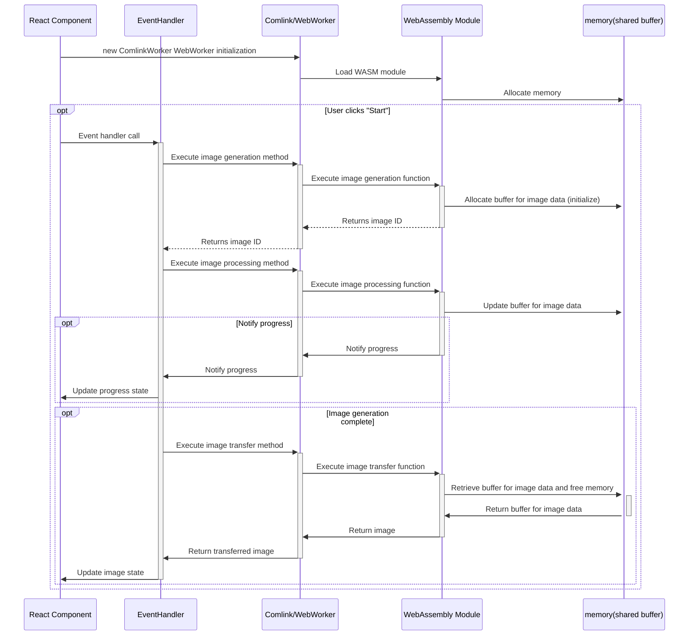
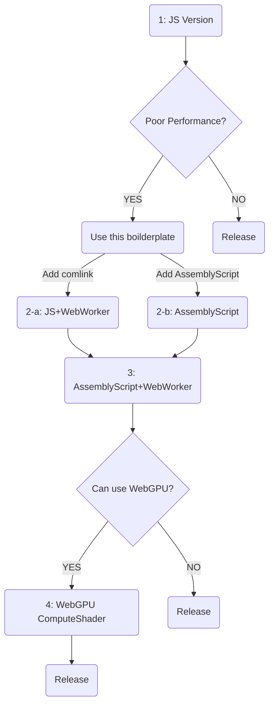

# What is this?

https://x.com/kubohiroya/status/1868272358794150117

To further expand the usability of [AssemblyScript](https://www.assemblyscript.org/) (WebAssembly), I have published a project on GitHub called [vite-react-comlink-worker-assemblyscript-webgpu-boilerplate](https://github.com/kubohiroya/vite-react-comlink-worker-assemblyscript-webgpu-boilerplate) (what a long name!).

https://github.com/kubohiroya/vite-react-comlink-worker-assemblyscript-webgpu-boilerplate

As the name suggests, this is a boilerplate setup that combines Vite + React + Comlink/WebWorker + AssemblyScript + WebGPU. It includes configuration files and sample code for developing applications with this stack.

By building this project as explained below, you can run the entire sample code suite as a React application. Specifically, it’s a [demo app that shows 5 different implementations of an averaging image filter](https://kubohiroya.github.io/vite-react-comlink-worker-assemblyscript-webgpu-boilerplate/):

1. JavaScript
2. JavaScript + WebWorker
3. AssemblyScript
4. AssemblyScript + WebWorker
5. WebGPU Compute Shader

Try opening it and experimenting with the actual behavior:

https://kubohiroya.github.io/vite-react-comlink-worker-assemblyscript-webgpu-boilerplate/

* Each implementation applies a 3x3 averaging image filter to the pixels of an image, effectively adding a type of “blur” to it.
* Users can control the number of times the image processing is applied (from 0 up to 500 times) using a slider.
* While image processing is applied repeatedly, the current iteration count and elapsed time are displayed in the UI.
* To verify situations where the UI thread might be blocked, a digital clock is constantly displayed at the top of the screen.

# Benchmark Results of the 5 Implementations

The table below shows the results obtained by running this sample code on a MacBook Pro 16-inch 2021 (Apple M1 Max 64GB). The image used is "[The Great Wave off Kanagawa](https://ja.wikipedia.org/wiki/%E7%A5%9E%E5%A5%88%E5%B7%9D%E6%B2%96%E6%B5%AA%E8%A3%8F)" at 1024x706 pixels (24-bit color). The 3x3 averaging filter was applied 200 times in succession.

You can watch a video of it actually running at the [X post mentioned at the beginning](https://x.com/kubohiroya/status/1868272358794150117).

| Time in video | Implementation                | Execution Time | UI Thread Blocking |
|---------------|-------------------------------|----------------|--------------------|
|0:00-0:08       | JavaScript                    | 4.52 s         | Blocked            |
|0:09-0:15       | JavaScript + WebWorker        | 4.80 s         | Not blocked        |
|0:16-0:18       | AssemblyScript                | 1.84 s         | Blocked            |
|0:19-0:21       | AssemblyScript + WebWorker    | 1.82 s         | Not blocked        |
|0:22-0:23       | WebGPU Compute Shader         | 0.07 s         | Not blocked        |

* The pure JavaScript implementation is the slowest, and execution time gets shorter in the order of AssemblyScript → WebGPU Compute Shader.
* The overhead of using a WebWorker is almost negligible.
* If you run the image processing without using a WebWorker, the UI thread will be blocked, making the UI unresponsive and preventing buttons from being pressed. Also note that when this happens, the clock displayed at the top of the screen stops, while a clock running in another window continues.
* By using a WebWorker, you can avoid blocking the UI thread. The clock keeps running, and the progress UI (a React Material UI Gauge component) is updated accordingly.
* At the end of the video (0:22~), when using the WebGPU Compute Shader implementation, the processing speed is overwhelming. Since WebGPU is designed as an asynchronous API from the start, there is no UI thread blocking.

# Key Points

* With a straightforward implementation, running heavy tasks like image processing can block the UI thread while the processing is ongoing, reducing usability. In such situations, consider offloading these tasks from the UI thread to a WebWorker.
    * Writing code to directly use WebWorkers can become very complicated, so it’s a good idea to use a library like [Comlink](https://github.com/GoogleChromeLabs/comlink).
* To reduce the time the UI thread is blocked, you can replace JavaScript (TypeScript) code with AssemblyScript and compile it to WebAssembly to achieve more efficient execution.
    * AssemblyScript’s syntax is very close to JavaScript (TypeScript), making it much easier and less error-prone for humans or generative AI to develop or convert existing code compared to C or Rust.
    * Even if you use AssemblyScript, you should still consider running it in a WebWorker rather than the UI thread.
* The current best practice seems to be a combination of “offloading processing via Comlink/WebWorker” and “migrating TypeScript code to AssemblyScript.”
    * When doing so, it’s also important to check whether you can easily call back host-side functions from within WebWorker/AssemblyScript code and whether the mechanism for doing so is user-friendly and reliable.
* If you are allowed to use WebGPU, it may be worth considering the use of WebGPU Compute Shaders instead of AssemblyScript.
    * In this example, applying the image processing task 200 times took 1.82 s with AssemblyScript + WebWorker, but only 0.07 s with a WebGPU Compute Shader. Although developing with WebGPU is a bit more cumbersome, the performance gain is substantial.

# The Execution Sequence of the AssemblyScript + WebWorker Version

In the following sections, we explain the AssemblyScript + WebWorker version in detail.

The sequence diagram below shows how messages pass between the layers of modules, from the top-level React component all the way down to the memory managed by WebAssembly. It outlines how messages are exchanged step-by-step.



Pay attention to the following three optional sequences in the diagram:

* User clicks the "Start" button: The image ID is returned back to a relatively shallow layer on the host side, namely the EventHandler.
* Progress notification: A callback is triggered from the WebAssembly module to the host side, causing the UI to update.
* Completion of image generation: This involves creating a view of the shared memory array on the WebAssembly side, deleting the object in the WebAssembly module’s memory, transferring the image data across the WebWorker boundary, returning a Promise to the host side, and finally displaying the generated image.

Although this configuration might look quite complicated at first glance, thanks to Comlink and AssemblyScript, you can develop with less redundant code that is more intuitive and easier to understand.

# Excerpts of Settings

## package.json Settings

Add the following to `package.json`:
```JSON:package.json
  "type": "module"
```
This enables ES Modules for the project.

For more details on other settings, please refer to [package.json](https://github.com/kubohiroya/vite-react-comlink-worker-assemblyscript-webgpu-boilerplate/blob/main/package.json).

## vite.config.ts Settings

Vite 

We use [Vite](https://vite.dev/)as the build environment.
* [vite-plugin-assemblyscript-asc](https://github.com/krymel/vite-plugin-assemblyscript-asc) allows building AssemblyScript source into a .wasm file.
* [vite-plugin-restart](https://github.com/antfu/vite-plugin-restart) is used to complement the lack of hot-reload support in vite-plugin-assemblyscript-asc.
* [vite-plugin-comlink](https://github.com/mathe42/vite-plugin-comlink) enables using ComlinkWorker types from TypeScript.
* Additionally, @vitejs/plugin-react is used for React development.

For details, see [vite.config.ts](https://github.com/kubohiroya/vite-react-comlink-worker-assemblyscript-webgpu-boilerplate/blob/main/vite.config.ts).

## tsconfig.json Settings

In `tsconfig.json`, under `compilerOptions`, add:

```JSON:tsconfig.json
  "compilerOptions":{
     :
    "target": "esnext",
    "module": "esnext",
    "lib": ["dom", "esnext", "webworker"],
    "types": ["node", "vite/client", "vite-plugin-comlink/client", "@webgpu/types"],
     :
  },
```
* Set `"target": "esnext"` and `"module": "esnext"` consistently, and add `"esnext"` to `"lib"`.
* Include `"webworker"` in `"lib"` to support WebWorker.
* Include `"vite/client", "vite-plugin-comlink/client"`, and `"@webgpu/types"` in `"types"` for type definitions and WebGPU support.

For details, see: [tsconfig.json](https://github.com/kubohiroya/vite-react-comlink-worker-assemblyscript-webgpu-boilerplate/blob/main/tsconfig.json).

## src/as/tsconfig.json Sețtings

AssemblyScript source files are placed under `src/as/assembly/**/*.ts`. Create a separate tsconfig.json for AssemblyScript sources at `src/as/tsconfig.json`:

```JSON:src/as/tsconfig.json
{
  "extends": "../../node_modules/assemblyscript/std/assembly.json",
  "compilerOptions": {
    "lib": ["esnext"],
    "module": "esnext",
    "imports": {
      "env": "env"
    }
  },
  "include": ["./**/*.ts"]
}
```
* `"extends"` points to `assembly.json` in `node_modules`.
* This prevents the editor from warning about AssemblyScript types like `i32`.
* `"imports"` setup is crucial for callback functions, etc.

For details, see [src/as/tsconfig.json](https://github.com/kubohiroya/vite-react-comlink-worker-assemblyscript-webgpu-boilerplate/blob/main/src/as/tsconfig.json).

## asconfig.json Settings

* `asconfig.json` configures the AssemblyScript compiler asc. 
Within `"target"`, set `"outFile"` and `"textFile"` for .wasm and .wat outputs. 
In this boilerplate, these files go under `./build` (You may need to add `./build` to your `.gitignore` file).

* Add "bindings": "esm" under "options":

```JSON:asconfig.json
  "options": {
    "bindings": "esm",
    "enable": [],
    "exportRuntime": true,
  }
```
Adjust other settings as needed. For SIMD, add `"enable": ["simd"]`.

For details, see [asconfig.json](https://github.com/kubohiroya/vite-react-comlink-worker-assemblyscript-webgpu-boilerplate/blob/main/asconfig.json).

# How to Run

```bash
git clone https://github.com/kubohiroya/vite-react-comlink-worker-assemblyscript-webgpu-boilerplate.git
cd vite-react-comlink-worker-assemblyscript-webgpu-boilerplate
pnpm install
pnpm run build
pnpm run dev
```

Access http://localhost:4200/ to use the sample app.

```bash
pnpm run preview
```
to preview the built version

# Migration Guide to AssemblyScript + WebWorker

Consider the following flow to improve performance:



## 1: JavaScript Version
* [src/benchmark/js/JSImageDataHandler.ts](https://github.com/kubohiroya/vite-react-comlink-worker-assemblyscript-webgpu-boilerplate/blob/main/src/benchmark/js/JSImageDataHandler.ts)
* [src/benchmark/js/applyAverageFilter.ts](https://github.com/kubohiroya/vite-react-comlink-worker-assemblyscript-webgpu-boilerplate/blob/main/src/benchmark/js/applyAverageFilter.ts)
* * Start with a simple JS implementation.
* No Comlink, no AssemblyScript. Ignore comlink related codes at the top and beginning. 

## 2-a: JavaScript + WebWorker Version
* Add Comlink and expose the handler via a WebWorker.
## 2-b: AssemblyScript Version
* [src/benchmark/as/ASImageDataHandler.ts](https://github.com/kubohiroya/vite-react-comlink-worker-assemblyscript-webgpu-boilerplate/blob/main/src/benchmark/as/ASImageDataHandler.ts)
* [src/as/assembly/asApplyAverageFilter.ts](https://github.com/kubohiroya/vite-react-comlink-worker-assemblyscript-webgpu-boilerplate/blob/main/src/as/assembly/asApplyAverageFilter.ts)
* Switch to calling AssemblyScript-compiled functions directly, no WebWorker.
 
## 3: AssemblyScript + WebWorker Version
* Combine AssemblyScript and a WebWorker via Comlink.
## 4: WebGPU Compute Shader Version
* If suitable, use a WebGPU Compute Shader for maximum speed.
* [src/benchmark/gpu/WebGPUImageDataHandler.ts](https://github.com/kubohiroya/vite-react-comlink-worker-assemblyscript-webgpu-boilerplate/blob/main/src/benchmark/gpu/WebGPUImageDataHandler.ts)
* [src/benchmark/gpu/applyAverageFilter.wgsl](https://github.com/kubohiroya/vite-react-comlink-worker-assemblyscript-webgpu-boilerplate/blob/main/src/benchmark/gpu/applyAverageFilter.wgsl)

# Conclusion

When performance is an issue, consider offloading heavy tasks to WebWorkers and implementing them in AssemblyScript. Use Comlink to simplify communication. If WebGPU is an option, it provides even greater performance gains.

This boilerplate consolidates current best practices and configurations. AssemblyScript and related tooling evolve rapidly, so you may need to adjust configurations over time.

In short, if WebGPU is feasible for your scenario, it’s probably worth using for computationally heavy tasks. If not, AssemblyScript + WebWorker is still a great improvement over a naive JavaScript-only approach.


